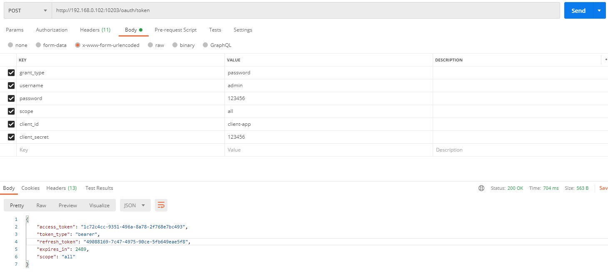

security-oauth认证服务端工程
----
**相关文档介绍**：https://www.marcobehler.com/guides/spring-security#oauth2

配置流程：
* 导入security和oauth2依赖
* 配置用户自定义资源类（DomainUserService），通过继承UserDetailsService类，根据用户名与数据库进行交互
* 配置授权服务类（AuthorizationServerConfig），通过继承AuthorizationServerConfigurerAdapter，配置用户存储方式（jwt或者redis）、用户授权方式及类型。
* 配置web安全类（WebSecurityConfig），通过继承WebSecurityConfigurerAdapter，配置用户加密方式及授权那些接口

****
密码模式访问：

 
 
 
---
填坑记录：
* 授权码模式访问会出现User must be authenticated with Spring Security before authorization can be completed.错误,暂未找到解决办法

